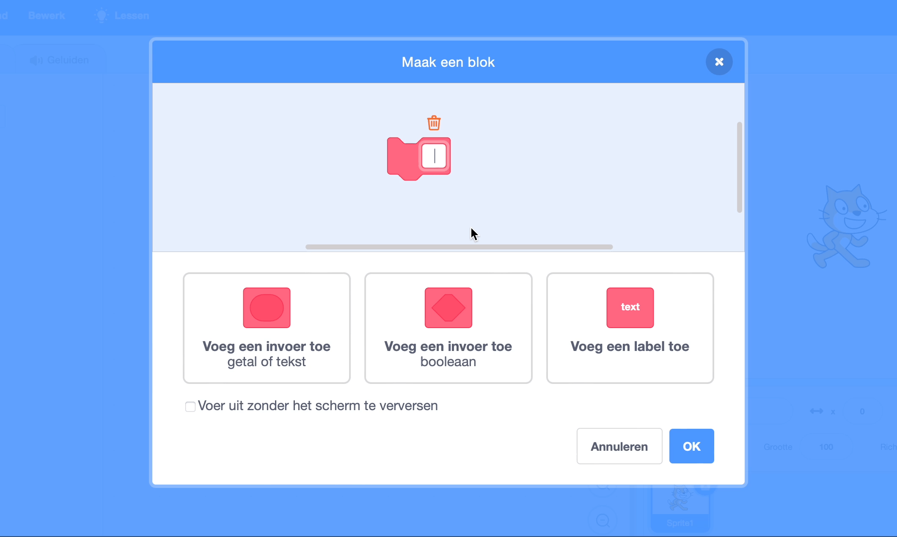

## Maak een patroon door vormen te klonen

<div style="display: flex; flex-wrap: wrap">
<div style="flex-basis: 200px; flex-grow: 1; margin-right: 15px;">
Kloon sprites om een patroon te maken.
</div>
<div>
{:width="300px"}
</div>
</div>

--- task ---

Open [het Scratch-starter project](https://scratch.mit.edu/projects/761934600/){:target="_blank"}. Scratch wordt in een nieuw browsertabblad geopend.

Als je offline werkt, kun je het [starter project](https://scratch.mit.edu/projects/761934600/){:target="_blank"} downloaden.

--- /task ---

Je zou een vormsprite moeten zien die een beetje lijkt op een bloemblaadje.

Je gebruikt `mijn blokken`{:class="block3myblocks"} om een patroon met deze vorm te maken. Herinner je nog het maken van `mijn blokken`{:class="block3myblocks"} om je code te organiseren in [Natuur Rover](https://projects.raspberrypi.org/nl-NL/projects/nature-rover/3){:target="_blank"}, en het herhalen van dezelfde code in [Puzzel kamer](https://projects.raspberrypi.org/nl-NL/projects/puzzle-room/4){:target="_blank"}? `Mijn blokken`{:class="block3myblocks"} kunnen ook worden gebruikt om acties op een andere manier te hergebruiken.

--- task ---

Ga naar `Mijn blokken`{:class='block3myblocks'} en geef je blokken een naam (we hebben het `patroon:`{:class="block3myblocks"} genoemd). Voeg `herhaal`{:class="block3myblocks"} toe als een label om de eerste invoer te identificeren of wat een programmeur een **parameter** noemt. Klik vervolgens op "Voeg een invoer toe" om de **parameter** met de naam `herhaal`{:class="block3myblocks"} te maken.





```blocks3
define patroon: herhaal (herhaal)
```

--- /task ---

Om te ontwerpen hoe een patroon wordt gemaakt, is de eerste stap het `definiëren van patroon`{:class='block3myblocks'}.

--- task ---

Sleep de `herhaal`{:class='block3myblocks'} parameter van `definieer patroon`{:class='block3myblocks'} naar een `herhaal`{:class='block3control'} lusblok.


```blocks3
define patroon: herhaal (herhaal)
repeat (herhaal)
```

--- /task ---

Je gaat nu `kloon`{:class='block3control'} blokken gebruiken om hetzelfde blok een aantal keren te laten verschijnen. Zorg ervoor dat je ook code toevoegt om de grootte en positie van de sprite te veranderen, anders worden de sprites boven op elkaar gestapeld en kun je ze niet zien.

--- task ---

Voeg wat code toe aan de `herhaal`{:class='block3myblocks'} lus van je `patroon`{:class='block3myblocks'}.


```blocks3
define patroon: herhaal (herhaal)
repeat (herhaal)
+ change size by (10) //Zodat je de klonen kunt zien
+ move (5) steps //Zodat je de klonen kunt zien
+ create clone of (myself v)
```

--- /task ---

**Tip:** `definiëring`{:class='block3myblocks'} maakt een algemeen patroon. Wat je nu maakt met `mijn blokken`{:class="block3myblocks"} is vergelijkbaar met het maken van een spirograph stencil; het is het gereedschap en het patroon wordt later gemaakt door het te gebruiken.


--- task ---

Maak een patroon met je `mijn blokken`{:class="block3myblocks"}. Laat het `patroon`{:class='block3myblocks'} een aantal keer `herhalen`{:class='block3myblocks'} `wanneer op de vlag wordt geklikt`{:class='block3events'}.


```blocks3
when flag clicked
show //Vorm wordt weergegeven 
set size to (50) % //Niet te groot
go to x: (0) y: (0) //Weergegeven in het midden
patroon: herhaal (3) ::custom
```

**Test:** Bekijk hoe je patroon eruit ziet door op de groene vlag te klikken om je programma uit te voeren.

--- /task ---

Je zou het begin van een mandala patroon moeten zien. Door meer **parameters** of vereisten aan je patroon toe te voegen, wordt het eerste deel van je mandala gemaakt.

--- save ---
