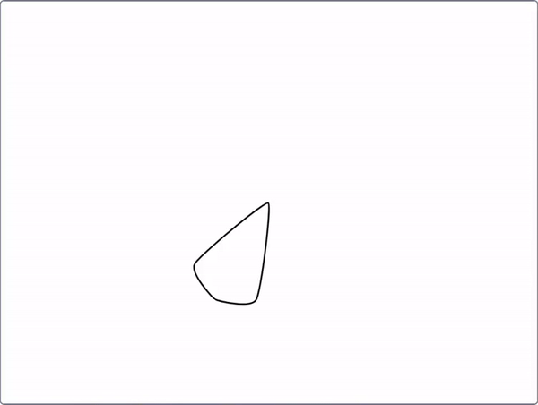
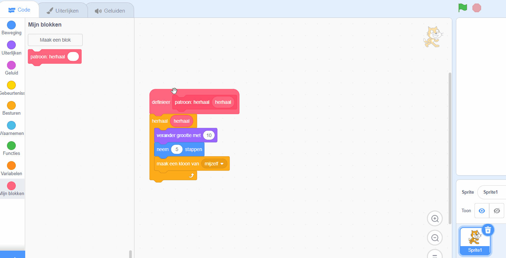
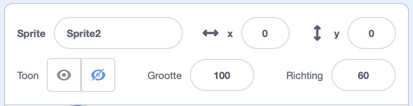

## Maak een mandala

<div style="display: flex; flex-wrap: wrap">
<div style="flex-basis: 200px; flex-grow: 1; margin-right: 15px;">
Maak meer patronen om een mandala te maken!
</div>
<div>
{:width="300px"}
</div>
</div>

--- task ---

Klik met de rechtermuisknop op het `definieer patroon`{:class="block3myblocks"} blok en kies **Bewerken** om meer parameters toe te voegen.



Je kunt beginnen door een `grootte`{:class="block3myblocks"} tekstlabel en een `grootte`{:class="block3myblocks"} invoer toe te voegen. Voeg vervolgens een `beweeg`{:class="block3myblocks"} label en invoer toe, en gebruik deze parameters in de blokken hieronder.


```blocks3
define patroon: herhaal (herhaal) grootte (grootte) beweeg (beweeg)
repeat (herhaal)
change size by (grootte)
move (beweeg) steps
create clone of (myself v)

when flag clicked
patroon: herhaal (3) grootte (10) beweeg (5)
```

--- /task ---

--- task ---

**Test:** Bekijk hoe je patroon eruit ziet door op de groene vlag te klikken om je programma uit te voeren. Het ziet er nog niet uit als een mandala! Kun je bedenken hoe je het patroon rond zou kunnen maken?

--- /task ---

Om je patroon cirkelvormig te maken en er nog meer uit te zien als een mandala, voeg je nog een invoer toe.

--- task ---

Voeg nog een invoer toe met de naam `draai`{:class="block3myblocks"}. Dan kun je niet alleen je kloon bewegen, maar ook draaien.


```blocks3
define patroon: herhaal (herhaal) grootte (grootte) beweeg (beweeg) draai (draai)
repeat (herhaal)
change size by (grootte)
move (beweeg) steps
create clone of (myself v)
+ change size by ([0] - (grootte))
+ move ([0] - (beweeg)) steps
+ turn right (draai) degrees
+ move (beweeg) steps
+ create clone of (myself v)
+ move ([0] - (beweeg)) steps
+ turn right (draai) degrees
end
```

--- /task ---

Mandala's zijn vaak complex — ze kunnen veel verschillende rijen hebben die vergelijkbare patronen volgen. Je kunt een basispatroon maken voor de rest van de mandala rijen om op te bouwen.

--- task ---

Probeer met verschillende nummers in je `patroon`{:class="block3myblocks"} te spelen. Je kunt de positie en grootte van je sprite op elk gewenst moment resetten.



```blocks3
when flag clicked
pattern herhaal (3) grootte (0) beweeg (0) draai (60) ::custom
```

--- /task ---


Nu je een basispatroon hebt, kun je je `patroon`{:class="block3myblocks"} een aantal keer gebruiken om een herhalend patroon te maken, of 'rijen' van een mandala. Door steeds dezelfde code te gebruiken maak je een programma dat **geoptimaliseerd** is.

<p style="border-left: solid; border-width:10px; border-color: #0faeb0; background-color: aliceblue; padding: 10px;">
<span style="color: #0faeb0">**Optimalisatie**</span> betekent dat je dingen op de meest efficiënte manier doet. Kijk naar het onderstaande diagram. Je zou van A naar E kunnen komen door het pad A-->B-->C-->D-->E te volgen Een optimalisatie zou zijn om A-->D-->E te gaan, die minder stappen en een kortere afstand bevat.

</p>

--- task ---

Voeg onder je `wanneer op de vlag wordt geklikt`{:class="block3events"} blok een paar **aanroepen** toe aan je `patroon`{:class="block3myblocks"}.


```blocks3
when flag clicked
patroon herhaal (3) grootte (0) beweeg (0) draai (60) ::custom
patroon herhaal (6) grootte (10) beweeg (45) draai (30) ::custom
patroon herhaal (6) grootte (10) beweeg (90) draai (30) ::custom
```

--- /task ---

--- task ---

**Test:** Klik op de groene vlag en kijk welk patroon wordt geproduceerd. Je kunt de getallen wijzigen om te experimenteren met patronen die je leuk vindt, of zelfs meer rijen toevoegen aan je `patroon`{:class="block3myblocks"}.

--- /task ---

--- save ---
