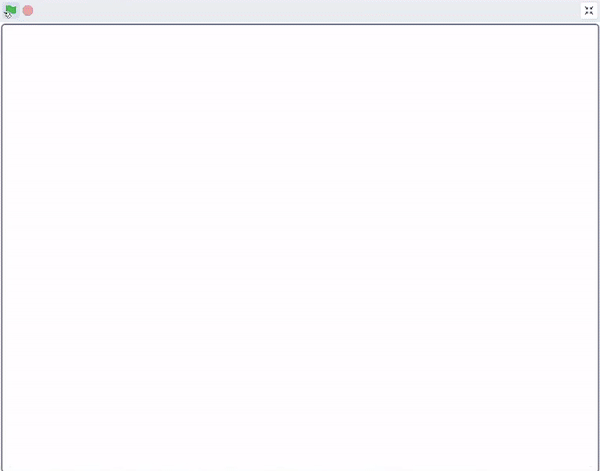
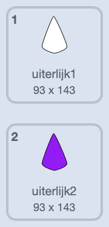
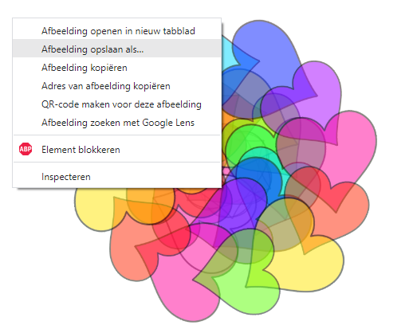

## Mandala kleuren

<div style="display: flex; flex-wrap: wrap">
<div style="flex-basis: 200px; flex-grow: 1; margin-right: 15px;">
Het toevoegen van kleur aan een mandala is zowel therapeutisch als creatief. Voeg de mogelijkheid toe om verschillende onderdelen van de mandala's te kleuren.
</div>
<div>
{:width="300px"}
</div>
</div>

**Tip:** als je wilt, kun je je mandala afdrukken voordat je er kleur aan toevoegt in deze stap, en het gebruiken als een kleurpatroon om met de hand te kleuren.

--- task ---

Bekijk de huidige uiterlijken voor je **vorm** sprite. Je zult zien dat er twee kostuums zijn, één wit en de andere gevuld.



--- /task ---

Om kleur toe te voegen aan je mandala, moet elk van de kloonvormen zijn `uiterlijk`{:class="block3looks"} veranderen en vervolgens ook het `kleureffect`{:class="block3looks"} wanneer op de kloon wordt geklikt. Het nieuwe uiterlijk zal **een** hoger zijn dan wat het vorige uiterlijk ook was, dus het zal veranderen naar de gekleurde versie en vervolgens naar de verschillende kleuren.

--- task ---

Voeg een `wanneer op deze sprite wordt geklikt`{:class="block3events"} blok toe en gebruik vervolgens de `+`{:class="block3operators"} operator om het nummer van het uiterlijk te wijzigen.


```blocks3
when this sprite clicked
switch costume to ((answer) + (1))
```

--- /task ---

--- task ---

Voeg een `verander kleureffect`{:class="block3looks"} blok toe aan dit script, zodat elke keer dat op de sprite wordt geklikt, de kleur een beetje verandert.


```blocks3
when this sprite clicked
switch costume to ((answer) + (1))
change [color v] effect by (25)
```

--- /task ---

Je herinnert je misschien dat je in de laatste stap een `transparant`{:class="block3myblocks"} blok-invoer aan je project hebt toevoegd. Je zou nu moeten kunnen zien wat er gebeurt als je het nummer wijzigt waar je `transparant`{:class="block3myblocks"} aanroept.

--- task ---

Maak het soort kleureffect dat je wilt door je `transparant`{:class="block3myblocks"} getallen te wijzigen. Een lager `transparant`{:class="block3myblocks"} getal betekent dat de kleur meer verzadigd is, zoals een permanente marker. Een hoog `transparant`{:class="block3myblocks"} getal betekent dat de kleur minder verzadigd is, net als waterverf.

--- /task ---

--- task ---

**Test:** Klik op de vlag, kies je uiterlijk en probeer vervolgens op de klonen te klikken om hun kleuren te veranderen.


Je zou een caleidoscoop-effect moeten krijgen wanneer kleuren elkaar overlappen.

--- /task ---

Als je de door jou gemaakte mandala leuk vindt, kun je **met de rechtermuisknop** op het speelveld klikken en ervoor kiezen om de afbeelding op te slaan.



--- save ---
