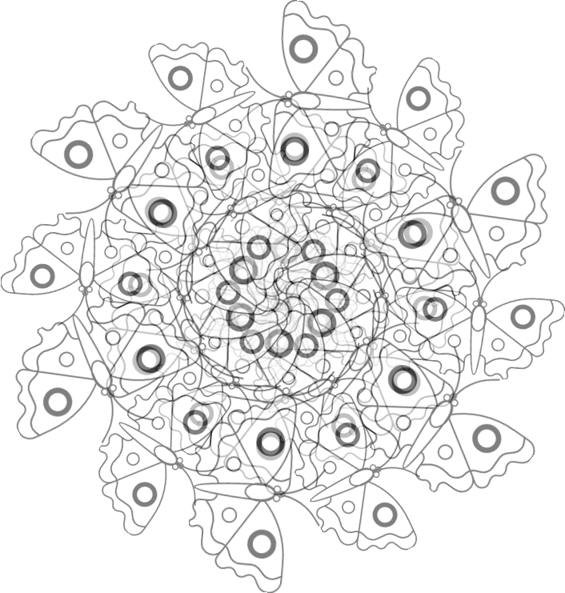
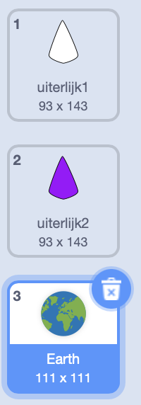
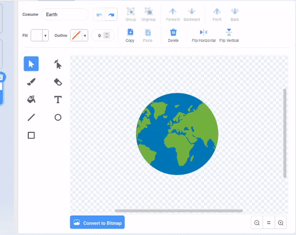
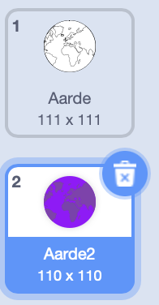
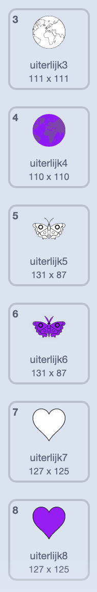
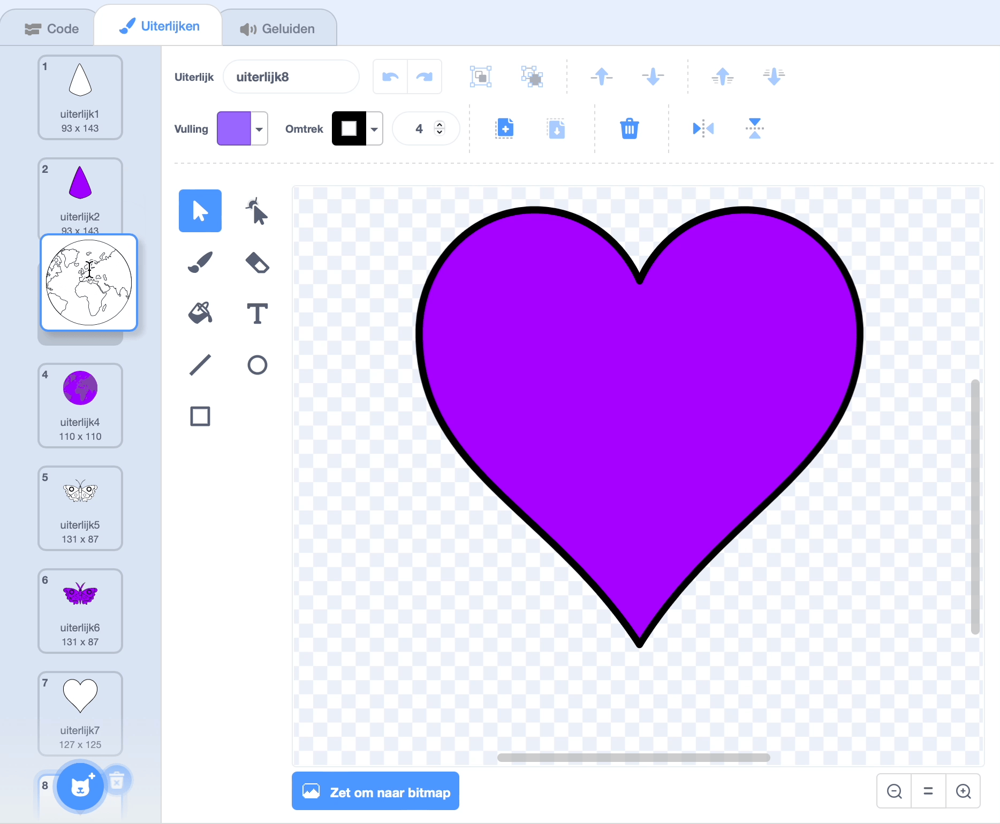

## Maak nog een mandala

<div style="display: flex; flex-wrap: wrap">
<div style="flex-basis: 200px; flex-grow: 1; margin-right: 15px;">
Je kan nu heel gemakkelijk nog een mandala maken met je geoptimaliseerde codeblokken.
</div>
<div>

</div>
</div>

Je hebt twee uiterlijken die je gebruikt om je gekleurde mandala te maken. Voeg wat meer uiterlijken toe om je mandala nog meer persoonlijk te maken.

--- task ---

**Kies:** Voeg nog een uiterlijk toe. Hier is het **Earth** uiterlijk gekozen.



Het maakt niet uit welk uiterlijk je kiest, maar je moet ervoor zorgen dat het een **Vector** uiterlijk is en geen **Bitmap** uiterlijk. Je kunt zien dat je een **Vector** uiterlijk hebt gekozen, omdat je een knop ziet met de naam **zet om naar bitmap**. **Klik niet op deze knop**. Als je een uiterlijk hebt geselecteerd dat een **Bitmap** is, verwijder het dan en kies een ander.


--- /task ---

--- task ---

Verwijder alle kleur uit het uiterlijk zodat je alleen de omtrek krijgt. Selecteer het hele uiterlijk en wijzig de **vulling** **Verzadiging** in `0` en de **Omtrek** **helderheid** in `0`.



--- /task ---

--- task ---

Kopieer dit uiterlijk en herhaal het proces, deze keer om de **vulling** kleur te veranderen in een donkere kleur naar keuze.



--- /task ---

--- task ---

Herhaal dit proces nog een paar keer met verschillende vector kostuums, zodat je straks uit verschillende stijlen van uiterlijken kan kiezen.



--- /task ---

Om ervoor te zorgen dat je je gepersonaliseerde mandala's kunt kleuren, kun je je uiterlijken opnieuw ordenen en op het juiste nummer controleren.

--- task ---

Verander de volgorde van je kostuums, zodat alle met wit gevulde kostuums aan de bovenkant staan, en de met kleuren gevulde kostuums lager zijn, maar nog steeds in dezelfde volgorde.



--- /task ---

Vergeet niet om te veranderen naar welk uiterlijk de mandala overschakelt, zodat je je nieuwe mandala's kunt kleuren. In het voorbeeldproject zijn er vier mandala's, dus hebben we het kostuumnummer veranderd van '1' in '4'


```blocks3
when this sprite clicked
+ switch costume to ((answer) + (4))
change [color v] effect by (25)
```

--- task ---

**Test:** Ga naar een van je nieuwe uiterlijken en klik op de groene vlag om het gegenereerde patroon te zien.

--- /task ---

--- save ---
