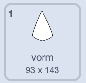
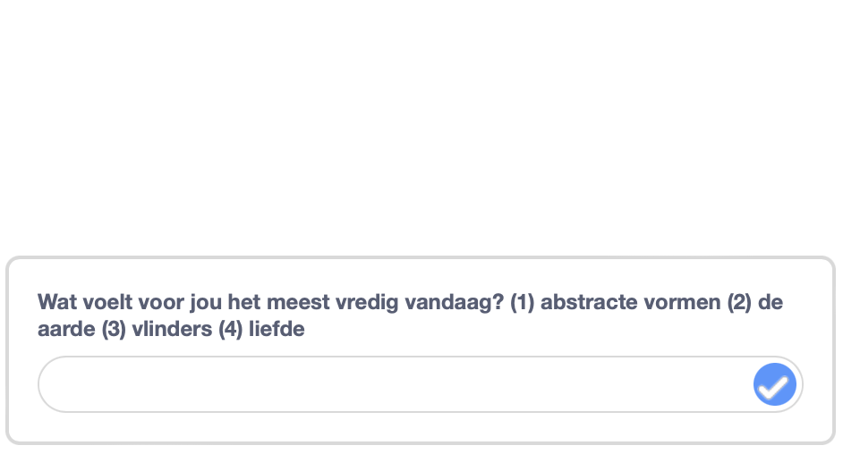

## Kies je mandala

<div style="display: flex; flex-wrap: wrap">
<div style="flex-basis: 200px; flex-grow: 1; margin-right: 15px;">
Iedereen is anders. Geef de gebruiker van jouw mandala-programma een keuze om een eigen mandala te maken.
</div>
<div>
{:width="300px"}
</div>
</div>

Je zou nu minstens twee verschillende mandala's moeten hebben. Je kunt een `vraag`{:class="block3sensing"} blok gebruiken om een startmenu te maken, dat je gebruiker een keuze geeft.

<p style="border-left: solid; border-width:10px; border-color: #0faeb0; background-color: aliceblue; padding: 10px;">
<span style="color: #0faeb0">**Startmenu's**</span> vind je vaak in games en apps. Ze laten de persoon die het spel speelt of de app gebruikt kiezen uit een aantal opties, bijvoorbeeld welk personage ze willen spelen of welke instellingen ze willen.
</p>

Maak de vraag die je gaat stellen in je startmenu.

--- task ---

Voeg een `vraag en wacht`{:class="block3sensing"} blok toe onder het `wanneer op de vlag wordt geklikt`{:class="block3events"} en kies de tekst voor je vraag, zoals in het onderstaande voorbeeld.



```blocks3
when flag clicked
+ hide
+ ask [What feels most peaceful to you today? (1) abstract shapes (2) the earth (3) butterflies (4) love] and wait
show
setup: size (60) ghost (50) y (10) move (10) ::custom
pattern: repeat (3) size (10) move (5) turn (60) ::custom
pattern: repeat (5) size (10) move (45) turn (30) ::custom
pattern: repeat (6) size (10) move (90) turn (30) ::custom
hide
```

--- /task ---

De reden om de sprite te te verbergen voordat je het `vraag en wacht`{:class="block3sensing"} blok gebruikt, is dat de vraag onderaan het speelveld verschijnt, in plaats van als een sprite.



Koppel het antwoord aan de juiste sprite om de juiste mandala te tonen.

--- task ---

Voeg een `verander uiterlijk naar`{:class="block3looks"} `antwoord`{:class="block3sensing"} blok onder het `vraag en wacht`{:class="block3sensing"} blok.


```blocks3
when flag clicked
hide
ask [What feels most peaceful to you today? (1) abstract shapes (2) the earth (3) butterflies (4) love] and wait
+ switch costume to (answer)
show
setup: (60) (50) (10) (10) ::custom
pattern: (3) (10) (5) (60) ::custom
pattern: (5) (10) (45) (30) ::custom
pattern: (6) (10) (90) (30) ::custom
hide
```

--- /task ---

--- task ---

**Test**: Probeer je mandala-project door op de vlag te klikken en een getal te kiezen.

--- /task ---

--- save ---
