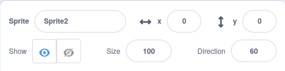

## Mandala ను తయారు చేయండి

<div style="display: flex; flex-wrap: wrap">
<div style="flex-basis: 200px; flex-grow: 1; margin-right: 15px;">
Mandala ని తయారు చేయడానికి మరిన్ని నమూనాలను సృష్టించండి!
</div>
<div>
{:width="300px"}
</div>
</div>

--- task ---

మరిన్ని పారామీటర్ లను జోడించడానికి మీ `define pattern`{:class="block3myblocks"} బ్లాక్‌పై రైట్ క్లిక్ చేసి, **Edit** ని ఎంచుకోండి.


మీరు `size`{:class="block3myblocks"} టెక్స్ట్ లేబుల్ మరియు `size`{:class="block3myblocks"} ఇన్‌పుట్‌ని జోడించడం ద్వారా ప్రారంభించవచ్చు. తర్వాత,  `move`{:class="block3myblocks"} లేబుల్ మరియు ఇన్‌పుట్‌ని జోడించి, దిగువ బ్లాక్‌లలో ఈ పారామీటర్లను ఉపయోగించండి.


```blocks3
define pattern: repeat (repeat) size (size) move (move)
repeat (repeat)
change size by (size)
move (move) steps
create clone of (myself v)

when flag clicked
pattern: repeat (3) size (10) move (5)
```

--- /task ---

--- task ---

**పరీక్ష:** మీ ప్రోగ్రామ్‌ని అమలు చేయడానికి ఆకుపచ్చ జెండాను క్లిక్ చేయడం ద్వారా మీ నమూనా ఎలా ఉందో చూడండి. ఇది ఇంకా mandala లా కనిపించడం లేదు! మీరు నమూనాను వృత్తాకారంగా ఎలా తయారు చేయవచ్చో ఆలోచించగలరా?

--- /task ---

మీ నమూనాను వృత్తాకారంగా చేయడానికి మరియు మరింత mandala లా కనిపించడానికి, మరొక ఇన్‌పుట్‌ని జోడించండి.

--- task ---

`turn`{:class="block3myblocks"} అని పిలువబడే మరొక ఇన్‌పుట్‌ని జోడించండి. అప్పుడు, అలాగే మీ క్లోన్‌ను కదిలించడంతోపాటు, మీరు దాన్ని కూడా తిప్పవచ్చు.


```blocks3
define pattern: repeat (repeat) size (size) move (move) turn (turn)
repeat (repeat)
change size by (size)
move (move) steps
create clone of (myself v)
+ change size by ([0] - (size))
+ move ([0] - (move)) steps
+ turn right (turn) degrees
+ move (move) steps
+ create clone of (myself v)
+ move ([0] - (move)) steps
+ turn right (turn) degrees
end
```

--- /task ---

Mandalaలు తరచుగా సంక్లిష్టంగా ఉంటాయి - అవి ఒకే విధమైన నమూనాలను అనుసరించే అనేక విభిన్న వరుసలను కలిగి ఉంటాయి. మీరు నిర్మించడానికి మిగిలిన mandala వరుసల కోసం బేస్ నమూనాను సృష్టించవచ్చు.

--- task ---

మీ `pattern`{:class="block3myblocks"}లోని విభిన్న సంఖ్యలతో ఆడటానికి ప్రయత్నించండి. మీరు ఎప్పుడైనా మీ sprite యొక్క స్థానం మరియు పరిమాణాన్ని రీసెట్ చేయవచ్చు.



```blocks3
when flag clicked
pattern repeat (3) size (0) move (0) turn (60) ::custom
```

--- /task ---


ఇప్పుడు మీరు ప్రాథమిక నమూనాను కలిగి ఉన్నారు, మీరు పునరావృతమయ్యే నమూనా లేదా mandala 'వరుసలు' చేయడానికి మీ నమూ`pattern`{:class="block3myblocks"}ని అనేక సార్లు ఉపయోగించవచ్చు. ఒకే కోడ్‌ని పదే పదే ఉపయోగించడం ద్వారా, మీరు **ఆప్టిమైజడ్**ప్రోగ్రామ్‌ను తయారు చేస్తారు.

<p style="border-left: solid; border-width:10px; border-color: #0faeb0; background-color: aliceblue; padding: 10px;">
<span style="color: #0faeb0">**ఆప్టిమైజేషన్**</span> అంటే పనులను అత్యంత సమర్థవంతంగా చేయడం. దిగువ రేఖాచిత్రాన్ని చూడండి. మీరు A->B-->C-->D-->E మార్గాన్ని అనుసరించడం ద్వారా A నుండి Eకి చేరుకోవచ్చు. ఆప్టిమైజేషన్ అనేది A-->D-->Eకి వెళ్లడం, ఇందులో తక్కువ దశలు మరియు తక్కువ దూరం ఉంటాయి.

</p>

--- task ---

`when flag clicked`{:class="block3events"} బ్లాక్ కింద, మీ `pattern`{:class="block3myblocks"} కి మరికొన్ని **calls** ను జోడించండి.


```blocks3
when flag clicked
pattern repeat (3) size (0) move (0) turn (60) ::custom
pattern repeat (6) size (10) move (45) turn (30) ::custom
pattern repeat (6) size (10) move (90) turn (30) ::custom
```

--- /task ---

--- task ---

**పరీక్ష:** ఆకుపచ్చ జెండాపై క్లిక్ చేసి, ఏ నమూనా ఉత్పత్తి చేయబడిందో చూడండి. మీకు నచ్చిన నమూనాలతో ప్రయోగాలు చేయడానికి మీరు సంఖ్యలను మార్చవచ్చు లేదా మీ `pattern`{:class="block3myblocks"}కి మరిన్ని calls ను జోడించవచ్చు.

--- /task ---

--- save ---
