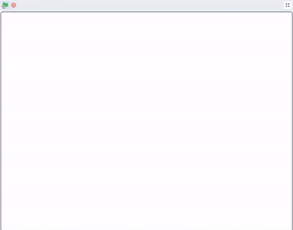
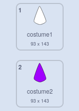

## Mandala రంగులు

<div style="display: flex; flex-wrap: wrap">
<div style="flex-basis: 200px; flex-grow: 1; margin-right: 15px;">
Mandala కి రంగును జోడించడం అనేది చికిత్సాపరమైన మరియు సృజనాత్మక కార్యకలాపం. Mandala లోని వివిధ భాగాలకు రంగులు వేసే అవకాశాన్ని జోడించండి.
</div>
<div>
{:width="300px"}
</div>
</div>

**చిట్కా:** మీకు కావాలంటే, ఈ దశలో మీరు మీ mandala కి రంగును జోడించే ముందు దాన్ని ముద్రించవచ్చు మరియు దానిని చేతితో రంగు వేయడానికి రంగుల నమూనాగా ఉపయోగించవచ్చు.

--- task ---

మీ **shape** sprite కోసం ప్రస్తుత costume లను చూడండి. రెండు costumeలు ఉన్నాయి, ఒకటి తెలుపు మరియు మరొకటి పూరించినట్లు మీరు చూస్తారు.



--- /task ---

మీ mandala నికి రంగును జోడించడానికి, క్లోన్‌ను క్లిక్ చేసినప్పుడు ప్రతి క్లోన్ ఆకారాలు దాని `costume`{:class="block3looks"}ని ఆపై `color effect`{:class="block3looks"}ని మార్చాలి. కొత్త costume మునుపటి దుస్తుల కంటే **ఒకటి** ఎక్కువగా ఉంటుంది, కనుక ఇది రంగుల వెర్షన్‌కి మరియు తర్వాత వివిధ రంగులకు మారుతుంది.

--- task ---

`when this sprite clicked`{:class="block3events"} బ్లాకుని జోడించి, ఆ తర్వాత, costume నంబర్ మార్చడానికి, `+`{:class="block3operators"} ఆపరేటర్ ను ఉపయోగించండి.


```blocks3
when this sprite clicked
switch costume to ((answer) + (1))
```

--- /task ---

--- task ---

ఈ స్క్రిప్ట్‌కి `change color effect`{:class="block3looks"} బ్లాక్‌ని జోడించండి, తద్వారా ప్రతిసారి sprite క్లిక్ చేసినప్పుడు, రంగు కొద్దిగా మారుతుంది.


```blocks3
when this sprite clicked
switch costume to ((answer) + (1))
change [color v] effect by (25)
```

--- /task ---

చివరి దశలో మీ ప్రాజెక్ట్‌కి `ghost`{:class="block3myblocks"} బ్లాక్ ఇన్‌పుట్‌ని జోడించడం మీకు గుర్తుండవచ్చు. మీరు `ghost`{:class="block3myblocks"}కి కాల్ చేసే నంబర్‌ను మార్చినప్పుడు ఏమి జరుగుతుందో మీరు ఇప్పుడు చూడగలరు.

--- task ---

మీ `ghost`{:class="block3myblocks"} నంబర్ లను మార్చడం ద్వారా మీకు కావలసిన రంగుల ప్రభావాన్ని సృష్టించండి. తక్కువ `ghost`{:class="block3myblocks"} నంబర్ అంటే పర్మినెంట్ మార్కర్ లాగా రంగు మరింత దట్టమైందని అర్థం. అధిక `ghost`{:class="block3myblocks"} నంబర్ అంటే నీటి రంగుల వలె రంగు పల్చ గా ఉంటుంది.

--- /task ---

--- task ---

**పరీక్ష:** ఫ్లాగ్‌పై క్లిక్ చేసి, మీ costume లను ఎంచుకోండి, ఆపై వాటి రంగులను మార్చడానికి క్లోన్‌లపై క్లిక్ చేసి ప్రయత్నించండి.


రంగులు ఒకదానిపై ఒకటి పొరలుగా ఉన్నప్పుడు మీరు కాలిడోస్కోప్ ప్రభావాన్ని పొందాలి.

--- /task ---

మీరు సృష్టించిన mandala ని మీరు ఇష్టపడితే, మీరు stage పై **రైట్- క్లిక్** చేసి, చిత్రాన్ని సేవ్ చేయడానికి ఎంచుకోవచ్చు.


--- save ---
