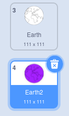

## మరొక mandala ను సృష్టించండి

<div style="display: flex; flex-wrap: wrap">
<div style="flex-basis: 200px; flex-grow: 1; margin-right: 15px;">
మీ ఆప్టిమైజ్ చేసిన కోడ్ బ్లాక్‌లను ఉపయోగించి మరొక mandala ని సులభంగా సృష్టించండి.
</div>
<div>

</div>
</div>

మీరు మీ రంగుల mandala ని సృష్టించడానికి ఉపయోగించే రెండు costume లు ఉన్నాయి. మీ mandala ని మరింత వ్యక్తిగతీకరించడానికి మరికొన్ని costume లను జోడించండి.

--- task ---

**ఎంచుకోండి:** మరొక costume జోడించండి. ఇక్కడ **Earth** costume ఎంచుకోబడింది.


మీరు ఏ costumeని ఎంచుకున్నారనేది ముఖ్యం కాదు, కానీ అది **Vector** costume అని మరియు **Bitmap** costume కాదని మీరు నిర్ధారించుకోవాలి. మీరు **Convert to Bitmap** అనే బటన్‌ను చూస్తారు కాబట్టి మీరు **Vector** costume ఎంచుకున్నారని చెప్పవచ్చు. **ఈ బటన్‌ని క్లిక్ చేయవద్దు**. మీరు **Bitmap** costume ని ఎంచుకున్నట్లయితే, దానిని తొలగించి, మరొక దానిని ఎంచుకోండి.


--- /task ---

--- task ---

దుస్తులు నుండి అన్ని రంగులను తీసివేయండి, తద్వారా మీరు కేవలం అవుట్‌లైన్‌ను పొందుతారు. మొత్తం costume ని ఎంచుకుని, **Fill** **Saturation** ను `0` కి మరియు **Outline** **Brightness** ను `0`కి మార్చండి.


--- /task ---

--- task ---

ఈ costume లను డూప్లికేట్ చేసి, ఆపై ప్రక్రియను పునరావృతం చేయండి, ఈసారి **Fill** రంగును మీకు నచ్చిన ముదురు రంగుకు మారుస్తుంది.



--- /task ---

--- task ---

విభిన్న వెక్టార్ costume లతో ఈ ప్రక్రియను మరికొన్ని సార్లు పునరావృతం చేయండి, మీకు విభిన్న శైలుల costume లు లభిస్తాయి.


--- /task ---

మీరు మీ వ్యక్తిగతీకరించిన mandala లకు రంగు వేయగలరని నిర్ధారించుకోవడానికి, మీ costume లను తిరిగి అమర్చండి మరియు సరైన నంబర్‌కు costume స్విచ్‌ అయ్యేలా తనిఖీ చేయండి.

--- task ---

మీ costume ల యొక్క క్రమాన్ని మార్చుకోండి, తద్వారా తెలుపు రంగుతో నిండినవి ఎగువన ఉంటాయి మరియు రంగులతో నిండినవి క్రిందికి ఉంటాయి, కానీ ఇప్పటికీ అదే క్రమంలో ఉంటాయి.


--- /task ---

మీరు మీ కొత్త mandala లకు రంగులు వేయగలిగేలా mandala ఏ costume లకు మారుతుందో గుర్తుంచుకోండి. ఉదాహరణ ప్రాజెక్ట్‌లో, నాలుగు mandalas ఉన్నాయి కాబట్టి మనము costume నంబర్‌ను '1' నుండి '4'కి మార్చాము


```blocks3
when this sprite clicked
+ switch costume to ((answer) + (4))
change [color v] effect by (25)
```

--- task ---

**పరీక్ష:** మీ కొత్త costume లలో ఒకదానికి మారండి మరియు రూపొందించబడిన నమూనాను చూడటానికి ఆకుపచ్చ జెండాను క్లిక్ చేయండి.

--- /task ---

--- save ---
